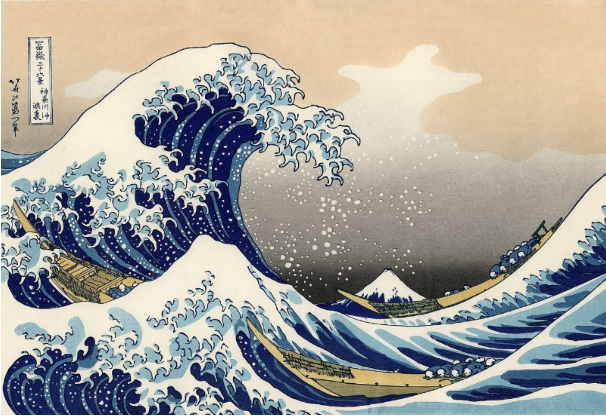
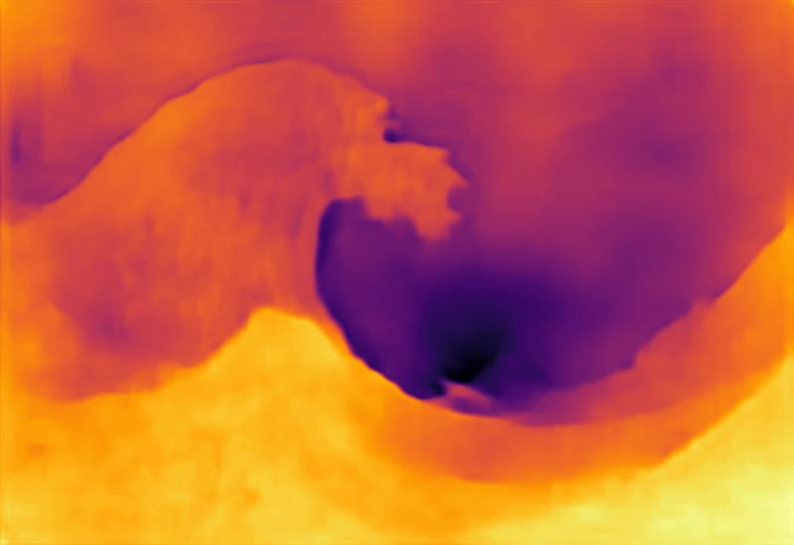
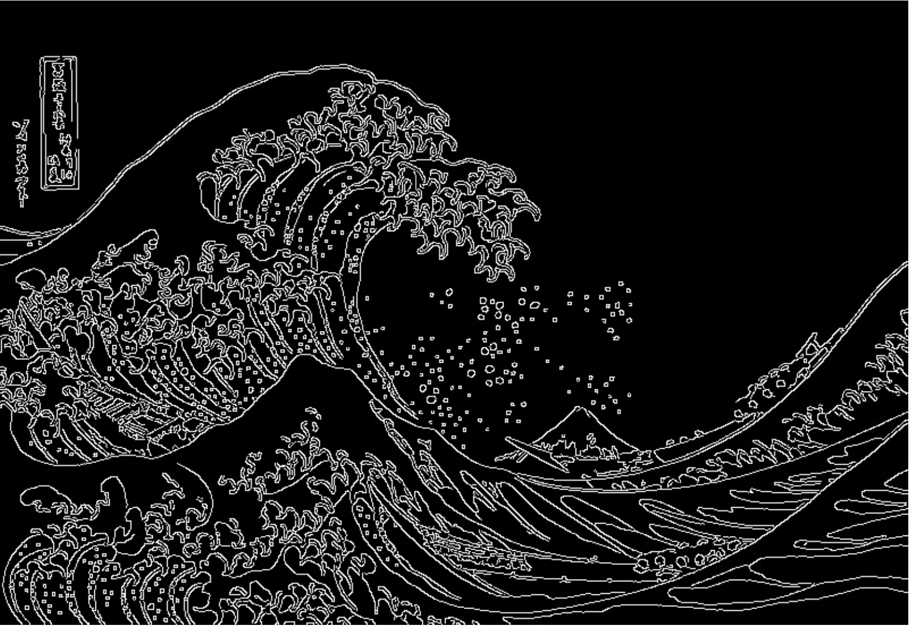

# Reliefeelable
Repository of code for Creating 3D tactile displays using 2d Images for paintings.

3D models of paintings
Our approach to getting 3D models from paintings is straightforward and includes just 3 steps:
1. Get the depth map of the image,
2. Add images features like edges & contours into the depth map,
3. Convert the depth map into a 3D model by converting depth to 3D pixel height on the Z-axis.

# Depth maps from monocular images 
Depth maps provide depth info for each pixel in the image.

## Original image

## Depth map

The map presents the picture's world in terms of depth from the viewer. Mt. Fuji at the center of
the image is clearly further away from the viewer than the waves. This is very useful information
about the picture. There are a few options when it comes to getting depth maps from monocular images, and we
prototyped with two models that are described below.

# Adding features into a depth map
The challenge with depth maps is that you lose more subtle features of the image. In the case of the Great Wave depth map, it has lost details about the boat and the foam from the wave. For a lot of famous paintings, these features are critical to the perception of the picture. Think Mona Lisa’s smile. Showing just the depth map, while better than nothing, isn’t enough to do justice to the quality of paintings. We need to find a way to bring back the details of the image.
 
One way to do so is to bring in the edges and contours of the image. We can use many of the common edge and contour detections algorithms to introduce features into the depth map. Consider this image of the Great Wave that has been processed with Canny edge detector:

